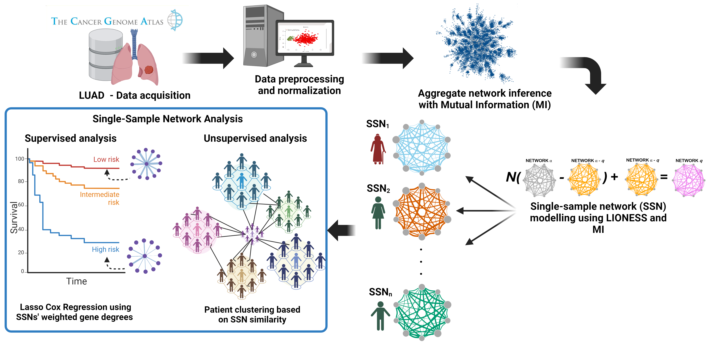

# Patient-Specific Gene Co-Expression Networks Reveal Novel Subtypes and Predictive Biomarkers in Lung Adenocarcinoma

### Overview
In this work, we inferred Single-Sample Gene Co-expression Networks (SSNs) from RNA-Seq Data obtained from the LUAD-TCGA cohort using Mutual Information (MI) and LIONESS (Linear Interpolation to Obtain Network Estimates for Single Samples) as the SSN reconstruction method.  


In general, our work can be divided into 4 main methodological aspects.
1. Data download, pre-processing, cleaning and normalization.
2. Patient-Specific network building with LIONESS-MI
3. Unsupervised graph-clustering based on SSN similarity
4. Supervised predictive modelling using SSN weighted gene degrees.

### Data download pre-processing, cleaning and normalization.
- ``TCGA_Biolinks_LUAD_download.R`` Retrieves clinical and RNA-Seq data from the TCGA-LUAD cohort and saves output .RDS file.

- ``RNASEQ_CLEAN.R`` Takes output RDS file from download script and applies cleaning and wrangling functions. Produces a cleaned .RDS file.

- ``NORMALIZATION.R`` Takes output clean .RDS, and applies normalization functions. Outputs summarized experiment with transformed expression data and PCA plots of normalized v.s. unnormalized samples.

- ``Survival_Prepare.R`` Uses survival data from primary tumor samples in the sumarized experiment and filters properly anotated samples for downstream analyses.

### Patient-Specific network building with LIONESS-MI

This section contains the tools needed to reconstruct single sample networks using a parallelized implementation of ARACNE (https://github.com/josemaz/aracne-multicore) and the LIONESS equation.

- ``get_aminq_mat.R`` Takes a complete ($\alpha$) expression matrix  as input, and iteratively removes sample $q$ and stores all $\alpha - q$ matrices.  First column of input matrix must be a list of gene ids and should be stored as a .tsv file

- ``aracne_run.sh`` Calls the multicore implementation of ARACNe2. Takes an expression matrix and desired number of processors as arguments and computes the Mutual Information (MI) for all gene pairs. The output is an adjacency matrix stored as .tsv file.

- ``get_SS_net.R``  Uses the LIONESS equation for any $\alpha - q$ matrix. The resulting networks are a list of all possible edges and their LIONESS score filtered to keep the upper triangular part of a symmetric adjacency matrix. All networks are stored as separate files for downstream analyses.

- ``lioness_aracne.sh`` Calls all the above mentioned scripts to calculate all single sample networks using ARACNe2.

- ``filter_nets.R`` Script for filtering fully-connected SSNs to a specified number of edges according to their strongest weights i.e. LIONESS Score.

### Unsupervised graph-clustering based on SSN similarity
- ``SSnet_pairwise_similarity.R`` Script for computing the intersection of edges between SSNs at a fixed network size. First argument is the directory where all SSNs are found. Second argument is the desired output.tsv file name

- ``SSN_similarity_analyses.R``  Script for patient similarity graph/matrix analyses: graph-clustering with the louvain method, CoDiNA analysis for obtaining conserved edges within clusters and building consensus networks, Xcell Cell-type enrichment and Clinical Overrepresentation testing.

### Supervised predictive modelling using SSN weighted gene degrees
- ``Calculate_Weighted_Degrees.R`` Takes the directory of SSNs as input and calculates the weighted degree (WD) of all genes for each SSN, building a WD matrix. 

- ``Lasso_Cox_Regression.R`` Using the WD matrix, performs a variety of Lasso regularized Cox regression modelling strategies. Measures predictive performance, goodness-of-fit, and uncertainty through random resampling. Finally, extracts the genes most frequently selected in the resampling procedure. 

## LIONESS-MI hands on

1. Follow the instructions in https://github.com/josemaz/aracne-multicore to install ARACNe-multicore.

2.  Clone this repository, and move all files and expression matrix of interest into the  ``launch`` directory.

3.  Run ``lioness_aracne.sh`` with the corresponding arguments:
- first argument must be the expression matrix of interest that meets the above mentioned criteria.
- second argument is the desired name of the output directory that will store all sample specific and aggregate networks.
- third argument is the desired number of processors that ARACNE should use in the network reconstruction process.
```bash
bash lioness_aracne.sh expression_matrix.tsv outputdir 20
```

